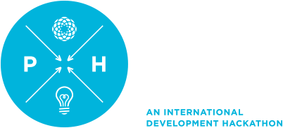

# AfricaAgenda2.0

Creating updated website for organization Africa Agenda as part of the [Posner Poverty Hack](http://povertyhack.posnercenter.org/). Built using AngularJS, Skeleton and SaSS. Team came in second.

## Mockups

